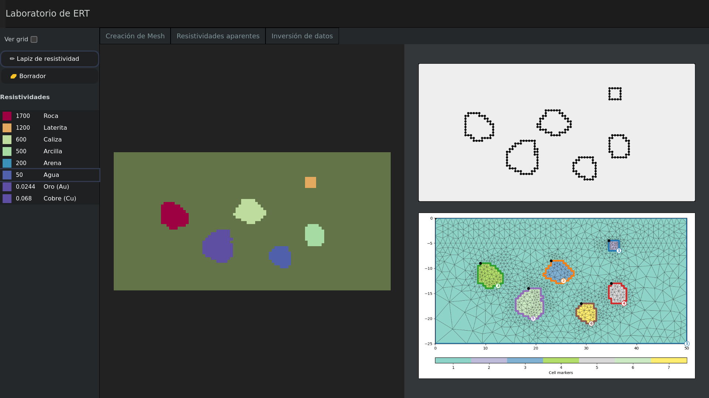

<!-- markdownlint-disable MD041 -->
<!-- markdownlint-disable MD022 -->

# ERT laboratory

A proof of concept for experimental and interactive ERT (real time meshing and inversion) research and teaching/learning. Made possible by [pygimli](https://pygimli.org/).
And a self made contour tracing algorithm.

## Acknowledgements

- <https://gpg.geosci.xyz/index.html>
- <https://pygimli.org/>
- <https://gitlab.com/hkex/resipy>
- <https://geoscienceletters.springeropen.com/articles/10.1186/s40562-022-00214-1>
